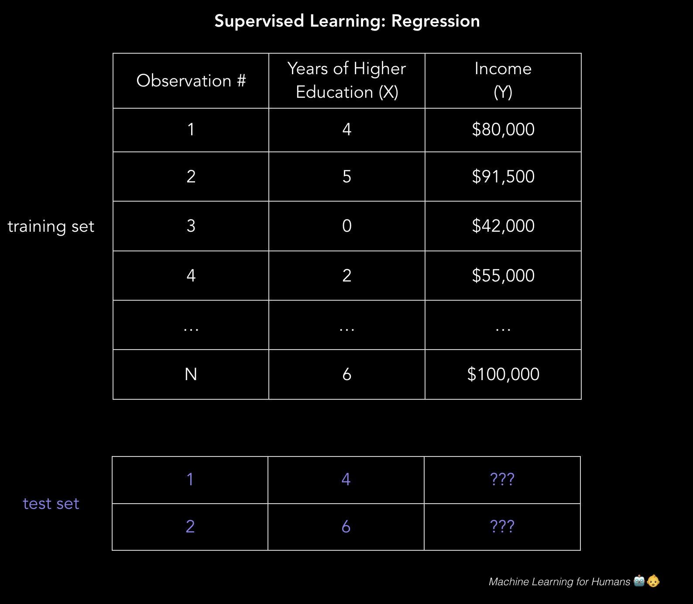
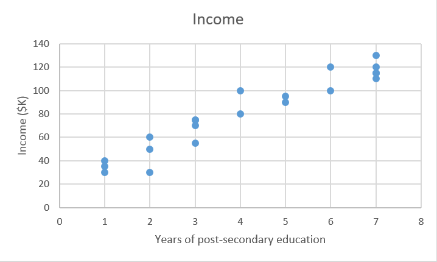
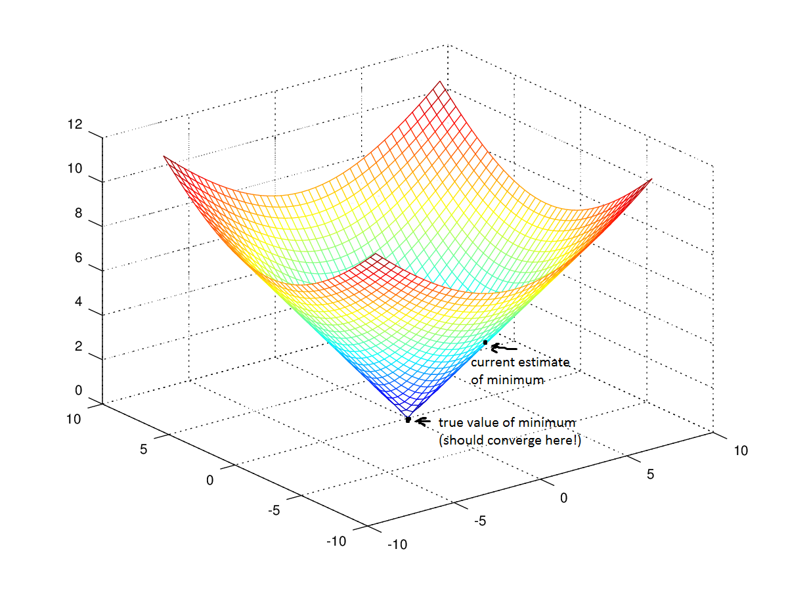

# 2.1 监督学习

> 原文：[Machine Learning for Humans, Part 2.1: Supervised Learning](https://medium.com/machine-learning-for-humans/supervised-learning-740383a2feab)

> 作者：[Vishal Maini](mailto:ml4humans@gmail.com)

> 译者：[飞龙](https://github.com/wizardforcel)

> 协议：[CC BY-NC-SA 4.0](http://creativecommons.org/licenses/by-nc-sa/4.0/)

> 监督学习的两大任务：回归和分类。线性回归，损失函数和梯度下降。

通过在数字广告上花费更多的钱，我们能挣多少钱？这个贷款的申请人是否能偿还贷款？股市明天会发生什么？

在监督学习的问题中，我们以一个数据集开始，它包含训练样本，每个样本带有关联的正确标签。例如，学习分类手写数字的时候，监督学习算法接受数千张手写体数字的图片，以及标签，它们包含每个图片表示的正确数字。算法会学习图像和关联的数值的关系。之后将学到的关系用于划分全新的图片（不带标签），机器从来没有见过它们。这就是你可以通过使用手机拍张照片，来存入支票的原因。

为了展示监督学习的工作原理，让我们看一个问题，根据某人完成的高等教育的年数，来预测年收入。更形式化来说，我们打算构建一个模型，它近似描述了高等教育年数`X`和对应年收入`Y`的关系`f`。

```
Y = f(X) + ϵ
```

> `X`（输入）为高等教育的年数
> `Y`（输出）为年收入
> `f`为描述`X`和`Y`关系的函数
> `ϵ`（epsilon）为随机误差项（可正可负），均值为零

> 关于`ϵ`：

> `ϵ`表示模型的残余误差，它是你的算法的理论极限，由于你尝试解释的现象中存在固有噪声。例如，想象构建一个模型来预测抛硬币的结果。

> 此外，数学家 [Paul Erdős](https://archive.is/o/VGPh3/https://en.wikipedia.org/wiki/Paul_Erd%C5%91s) 将孩子们称为`ϵ`，因为在微积分中（而不是统计学），`ϵ`代表任意小的正数值。很恰当吧？

一种预测收入的方式，就是创建一个基于规则的严格模型，来表示收入和教育如何相关。例如，我估计出，高等教育每增加一年，年收入增加 $5000。

```
income = ($5,000 * years_of_education) + baseline_income
```

> 这个方式就是构建一个解的示例（而不是学习一个解，就像下面描述的线性回归方法那样）。

通过包含一些规则，关于学位类型、工作年数、学校的层次，以及其它，你可以提出一个更复杂的模型。例如，“如果他们完成了学士或更高的学位，就将收入估计为 1.5 倍”。

但是这种类型的，明确的基于规则的规划，对于复杂数据不是很有效。想像一下，尝试设计一个图像分类器算法，它由`if-then`语句组成。这些语句描述了像素亮度的组合，来判断它是否是一只猫。

监督机器学习通过让计算机为你工作，来解决这个问题。通过识别数据中的规律，机器能够得到启发。这个和人类学习最大的差异是，机器学习运行在计算机硬件上，并且可以通过计算机科学和统计学的视角很好地理解，然而人类的模式识别发生在生物大脑中（不过完成了相同的目标）。

在监督学习中，机器试图从零开始 学习收入和教育之间的关系，通过使用带标签的训练数据来运行算法。习得的函数可以用于估计人们的收入，其中收入`Y`是未知的，只要我们将教育年数`X`作为输入。换句话说，我们可以将我们的模型用于不带标签的测试数据来估计`Y`。

监督学习的目标是，当获得`X`已知`Y`未知的新样本时，尽可能准确地预测`Y`。下面我们会探索多种最常见的方法。

## 监督学习的两个任务：回归和分类

> 回归：预测连续数值。某个房子售价是多少？

> 分类：分配标签。某幅画是猫还是狗？

这一节的剩余部分会关注回归。2.2 节中我们会深入分类方法。

## 回归：预测连续值

回归预测连续的目标变量`Y`。它允许你估计一个值，例如房价或者人类寿命，基于输入数据`X`。

这里，目标变量的意思是我们所关心的，用于预测的位置变量。连续的意思是，在`Y`可以取的值中，不存在间隔（不连续）。另一方面，离散变量，只可以取有限个数的值。例如，孩子的数量是个连续变量。

收入的预测是个经典的回归问题。你的输入数据`X`包含所有数据集中的个体的相关信息，可以用于预测收入，例如教育年数、工作年数、职位、或者邮政编码。这些属性叫做特征，它们可以是数值（例如工作年数），或者分类（例如职位和研究领域）。

你可能想要尽可能多的，和这些特征相关的训练观测值，来定位输出`Y`，使你的模型可以学习`X`和`Y`之间的关系`f`。

数据分为训练集和测试集。训练集拥有标签，所以你的模型可以从这些带标签的样本中学习。测试集不带标签，也就是，你还不知道你尝试预测的值。你的模型可以推广到从未见过的情况，以便它在测试数据上表现良好，这个十分重要。

> 回归

> `Y = f(X) + ϵ`，其中`X = (x1, x2 … xn)`

> 训练：机器从带标签的训练数据习得`f`

> 测试：机器从不带标签的测试数据预测`Y`

> 要注意，`X`可以是个张量，它的维度可以是任意的。一维张量是向量（一行多列），二维张量是矩阵（多行多列）。你也可以拥有三、四、五甚至更高维的张量（例如三维张量拥有行、列和深度）。为了回顾这些术语，请参考[线性代数回顾](https://www.deeplearningbook.org/contents/linear_algebra.html)的前几页。

在我们的非常简单的二维示例中，它的形式是`csv`文件，其中每行包含一个人的教育水平和收入。使用更多特征来添加更多的列，你可以拥有更加复杂但是可能更加准确的模型。



## 所以我们如何解决这些问题？

我们如何构建模型，在现实世界中做出更准确、实用的预测？我们可以通过使用监督学习算法来实现。

现在让我们进行最有意思的部分：了解算法。我们会探索几种方式来实现回归和分类，并且展示机器学习概念中的关键。

## 线性回归（普通最小二乘）

> 画一条直线。是的，这也算机器学习。

首先，我们专注于使用线性回归解决收入预测问题，因为线性模型不是很适合图像识别任务（这是深度学习的领域，我们之后也会探索）。

我们拥有数据集`X`，以及对应的目标值`Y`。普通最小二乘（OLS）的目标是，习得一个线性模型，如果我们得到了一个未见过的`x`，我们可以用它来预测新的`y`，并且误差尽可能小。我们打算基于某个人的教育年数，猜测它的收入。

```py
X_train = [4, 5, 0, 2, …, 6] # 高等教育的年数
Y_train = [80, 91.5, 42, 55, …, 100] # 对应的年收入，单位为千美元
```



线性回归是个参数化方法，也就是说，它需要作出`X`和`Y`的函数形式的假设（我们之后会涉及非参数化方法的示例）。我们的模型是个函数，使用特定的`x`预测`ŷ`：


> 这里，我们做出了一个明确的假设，`X`和`Y`是存在线性关系的。也就是说，对于每个`X`中的单位增长，`Y`的增长（或下降）不变。

`β0`是纵截距，`β1`是直线斜率，也就是教育每增加一年，收入增长（或者下降）多少。

我们的目标是，习得模型参数（这里是`β0`和`β1`），使模型预测中的误差最小。

为了寻找最佳的参数：

1.  定义一个成本函数，或者损失函数，它度量了我们的模型的预测有多么准确。

2.  寻找使损失最小的参数，也就是，使我们的模型尽可能准确。

以图形的方式，在二维中，它会产生一条最佳拟合直线。在三维中，我们可以画一个平面，所以高维中就是超平面。

> 维度的注解：为了简便，我们的示例是二维的，但是你的模型通常拥有更多特征（`x`）和系数（`β`）。例如，添加更多相关变量，来提升模型预测的准确性。相同的原理可以推广到高维，虽然超过三维的东西很难可视化。


在数学上，我们观察每个真实数据点（`y`）和我们的模型的预测（`ŷ`）之间的差。计算这些差的平方来避免负数，并惩罚较大的差，之后将它们相加并取平均。这度量了我们的数据有多么接近直线。


> `n`为观察值的的数量。使用`2 * n`来代替`n`，在求导来使损失最小时，使我们的式子更加整洁，虽然一些统计学家认为这是这种亵渎。当你开始对这种东西有意见的时候，你就太偏执了。

对于一个像这样的简单问题，我们可以使用微积分计算闭式解，来寻找最佳的`β`参数，它使我们的损失函数最小。但是随着成本函数的复杂性的增长，使用微积分寻找闭式解就不太可能了。这就推动了一种迭代方式，叫做梯度下降，它允许我们使复杂的损失函数最小。

## 梯度下降：习得参数

> 蒙住眼睛，向下走一步。当你无路可走只能向上的时候，你就到了底部。

梯度下降会一遍一遍地出现，特别是在神经网络中。机器学习库，例如 scikit-learn 和 TensorFlow 会在背后的任何地方使用它，所以它值得了解细节。

梯度下降的目标是寻找我们模型的损失函数的最小值，通过在迭代中得到它的越来越好的近似值。

想象你自己蒙上眼睛穿过一个山谷。你的目标是寻找山谷的底部。你要怎么做呢？

一个可行的办法是，触摸你周围的地面，向地面下降最快的方向移动。走出一步，之后不断重复相同的过程，直到地面变成平的。之后你就知道了你到达了山谷的底部。如果你在所在位置向任何方向移动，你最终都会位于相同的高度，或者更高。

回到数学，地面变成了损失函数，山谷底部的高度变成了函数的最小值。

让我们看一看回归中的损失函数：


我们看到这个实际上是两个变量的函数：`β0`和`β1`。所有其余变量都是已确定的，因为`X`，`Y`和`n`都在训练过程中提供了。我们打算尝试使这个函数最小。



这个函数是`f(β0,β1)=z`。为了开始梯度下降，你需要对参数`β0`和`β1`做出一些猜测，它们使函数最小。

下面，你寻找损失函数对每个`β`参数的偏导数`[dz/dβ0, dz/dβ1]`。偏导数表示，如果你为`β0`或者`β1`增加一个很小的值，总损失增加或减少多少。

换一种方式。假设教育年数（`β0`）为零会增加模型的损失（也就是不准确度），这会将你的年收入的估计值增加多少？你需要向相反方向移动，以便你最终向下走并使损失最小。

与之类似，如果你增加“教育年数的每个增量会影响多少收入”的估计量（`β1`），这会将损失（`z`）增加多少？如果偏导数`dz/β1`是个复数，那么`β1`的增加是极好的，因为它会降低总损失。如果它是个正数，你需要降低`β1`。如果是零，不要修改`β1`，因为这表示你已经到达最优了。

持续做这件事，直到你到达了底部，也就是，算法收敛，损失到达最小。存在大量技巧和例外情况，它们超出了这一章的范围，但是通常来说，这就是你为你的参数化模型寻找最优参数的方式。

## 过拟合

