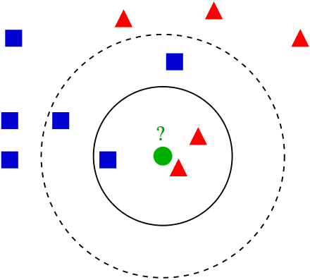
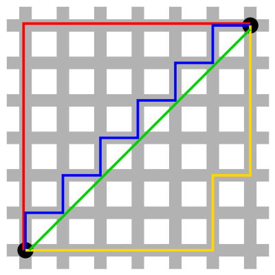
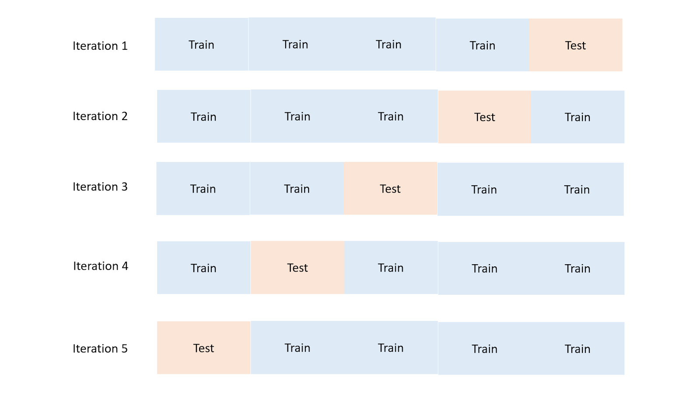
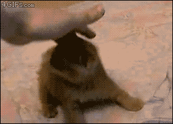

# 2.3 监督学习 III

> 原文：[Machine Learning for Humans, Part 2.3: Supervised Learning III](https://medium.com/machine-learning-for-humans/supervised-learning-3-b1551b9c4930)

> 作者：[Vishal Maini](mailto:ml4humans@gmail.com)

> 译者：[飞龙](https://github.com/wizardforcel)

> 协议：[CC BY-NC-SA 4.0](http://creativecommons.org/licenses/by-nc-sa/4.0/)

> 非参数化模型：KNN、决策树和随机森林。包含交叉验证、超参数调优和集成模型。

## 非参数学习器

> 事情变得有点...奇怪了。

我们目前为止涉及的方法，线性回归，对率回归和 SVM ，它们的模型形式是预定义的。与之相反，非参数学习器事先没有特定的模型结构。在训练模型之前，我们不会推测我们尝试习得的函数`f`的形式，就像之前的线性回归那样。反之，模型结构纯粹由数据定义。

这些模型对于训练数据的形状更加灵活，但是有时会有可解释性的代价。不久你就会更理解它。让我们继续吧。

## K 最近邻（KNN）

> 你是你的最亲密的 K 个朋友的均值。

KNN 看起来图样图森破，不像是机器学习算法。它的思路是，通过寻找 K 个最近的数据点的标签，来标记测试数据点`x`。

看一看下面的图像。让我们假设，你想知道，迷之绿色圆圈是红色三角还是蓝色方块。你怎么做呢？

你可以尝试提出一个迷之方程，它查看绿色圆圈在坐标平面的哪里，并作出相应的预测。或者，你可以仅仅查看三个最近的邻居，并猜测绿色圆圈可能是个红色三角。你也可以进一步扩展圆圈，并查看五个最近邻，并这样作出预测（五个最近邻里面，有三个蓝色方块，所以我们猜测，`k=5`时迷之绿色圆圈是蓝色方块。

> KNN 的演示，其中`k=1, 3, 5`。为了划分上面的迷之绿色圆圈（`x`），查看它的单个最近邻，是个“红色三角”。所以我们猜测`ŷ`为“红色三角”。`k=3`时，查看三个最近邻：这里的众数仍然是“红色三角”，所以`ŷ`为“红色三角”。`k=5`时，我们选取五个最近邻的众数，要注意`ŷ`变为了“蓝色三角”。图片来自维基百科。

就是这样。这就是 KNN。你查看了 K 个最近的数据点，如果变量是连续的（例如房价），取它们的均值；如果变量是离散的（例如猫或者狗），取它们的众数。

如果你打算猜测未知房价，你可以选取一些地理上邻近的房子，然后取平均，你就会得到一些很棒的猜测。这可能甚至优于参数化回归模型，一些经济学家构建了它们来估计卧室/浴室、邻近的学校、公共交通的距离，以及其它的数量的参数。

> 如何使用 KNN 来预测房价：

> 1) 储存训练集。`X`是特征，例如邮政编码、邻居、卧室数量、面积、公共交通的距离，以及其它。`Y`是对应的售价。

> 2) 将你的训练集排序，按照与测试集中的房子的相似性，基于`X`中的特征。我们下面会定义“相似性”。

> 3) 计算 K 个最邻近的房子的均值。这就是你对售价（也就是`ŷ`）的猜测。

KNN 不需要预定义的参数化函数`f(X)`，它用于将`Y`与`X`相关联。这使得它更适合关系过于复杂，不能用简单的线性模型表示的情况。

### 距离度量：定义和计算“邻近性”

在寻找“最近邻”的时候，你如何计算问题中的数据点的距离呢？你如何在数学上判断，示例中的哪个蓝色方块和红色三角更接近绿色圆圈？尤其是，如果你无法画出一幅漂亮的二维图像，用眼睛观测它？

最直接的度量是欧氏（几何）距离（“像乌鸦飞过”的一条直线）。另一个是曼哈顿（街区）距离，就像在城市块中行走。你可以想象，在涉及到 Uber 司机的费用计算的模型中，曼哈顿距离更加实用。

> 绿色直线为欧氏距离。蓝色直线为曼哈顿距离。来源：维基百科

还记得用于寻找直角三角形斜边长度的毕达哥拉斯（勾股）定理嘛？

> `c`为斜边（上面的绿色直线），`a`和`b`是两个直角边（上面的红色直线）。

通过计算`a`和`b`长度的平方和的平方根，我们就解出了`c`，求出了斜边长度。这里`a`和`b`是三角形的直角（正交）边（也就是，它们互为 90 度角，在空间中垂直）。

给定两个正交方向的向量的情况下，求解斜边长度的思路，可以推广到多维。这就是 N 维空间的点`p`和`q`的欧氏距离`d(p,q)`的推导方式：

> 欧氏距离的公式，由勾股定理推出。

使用这个公式，你可以计算所有训练数据点，到你尝试标注的数据点的邻近度，并选取 K 个最近邻的均值或众数，来做出你的预测。

通常你不需要手动计算任何距离，用搜索引擎简单搜索一下，你就能在 NumPy 或者 SciPy 找到预构建的函数，会为你做这个事情，例如，`euclidean_dist = numpy.linalg.norm(p-q)`。但是看到八年级的集合概念如何有助于构建当今的 ML 模型，这很有趣。

### 选取`k`：使用交叉验证调优超参数

为了决定我们使用哪个`k`，你可以测试不同的 KNN 模型，使用交叉验证以及`k`的不同值。

+   将你的训练集分成两部分，在一部分上训练模型，将保留的部分用作测试集。

+   通过将模型的预测（`ŷ`），与测试数据的真实值（`y`）相比，看看你的模型表现如何。

+   在所有迭代中，通常选取误差最小的模型。

> 交叉验证的演示。分块和迭代的数量可以修改。

### K 的较高值防止过拟合

K 的较高值能防止过拟合，但是如果 K 太高的话，你的模型会有很大偏差，并且不灵活。选取一个极端的示例：如果`k=N`（数据点的总数），模型就失效了，将所有测试数据分类为训练数据的均值或者众数。

如果动物数据集中的单个最常见的动物是苏格兰折耳猫，`k=N`（训练观测值数量）的 KNN 会将实际上的每个其它动物预测成它。在 Vishal 看来，这个很棒，但 Samer 不同意。

> 完全没有来由的苏格兰折耳猫`.gif`。我们可以休息一下。

### 真实世界中使用 KNN 的地方

一些你可以使用 KNN 的地方：

+   分类：诈骗检测。模型可以使用新的训练样本马上更新，因为你仅仅是存储新的数据点，这允许你快速适应新的诈骗方法。

+   回归：预测房价。在房价预测中，字面上的“最近邻”实际上很好暗示了价格上的相似。KNN 在物理相似性很重要的领域很实用。

+   填充缺失的训练数据。如果你的`.csv`中的一列有大量缺失值，你可以通过选取均值或者众数填充数据。KNN 可能会给你每个缺失值的更加准确的猜测。

