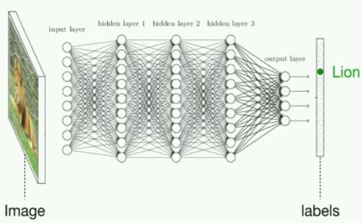
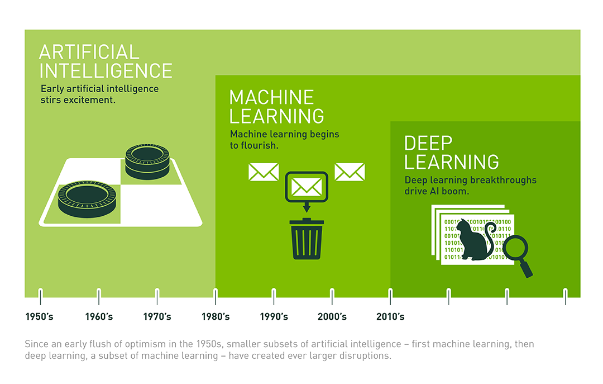

# 四、神经网络和深度学习

> 深度神经网络的工作地点、原因和方式。从大脑中获取灵感。卷积神经网络（CNN）和循环神经网络（RNN）。真实世界中的应用。

使用深度学习，我们仍然是习得一个函数`f`，将输入`X`映射为输出`Y`，并使测试数据上的损失最小，就像我们之前那样。回忆一下，在 2.1 节监督学习中，我们的初始“问题陈述”：

> `Y = f(X) + ϵ`

> 训练：机器从带标签的训练数据习得`f`

> 测试：机器从不带标签的测试数据预测`Y`

真实世界很乱，所以有时`f`很复杂。在自然语言问题中，较大的词汇数量意味着大量特征。视觉问题设计大量的像素相关的视觉信息。玩游戏需要基于复杂场景做决策，也带有许多可能的未知。当我们处理的数据不是很复杂时，我们目前涉及的学习机制做的很好。但是，它们如何推广到像这样的场景，还不清楚。

深度学习非常善于习得`f`，特别是在数据很复杂的场景中。实际上，人工神经网络也被成为通用函数近似器，因为它们能够学习任何函数，无论多么扭曲，都只需要一个隐藏层。

让我们看看图像分类的问题。我们选取一张图片作为输入，并输出一个分类（例如狗、猫、车）。

通过图解，深度神经网络的图像分类解决方式，类似于这样：

> 图片来自 Jeff Clune 在 YouTube 上的一小时深度学习概览

但是说真的，这是个巨大的数学方程，有数百万个项和大量参数。假设输入`X`是灰度图像，由`w*h`的像素亮度矩阵表示。输出`Y`是每个分类的概率的向量。也就是说，我们输出“每个分类是正确标签”的概率。如果这个神经网络能用的话，最高的概率就是正确的分类。然后，中间的层仅仅计算大量的矩阵相同，通过在每个隐藏层之后，使用非线性变换（激活函数），对激活值`x`的权重求和，来让神经网络习得非线性函数。

难以置信的是，你可以使用梯度下降，以 2.1 节中我们对线性回归所做的相同方式，使损失最小。所以使用大量样本和大量梯度下降，模型可以习得如何正确分类动物图片。这个，简单来说，就是“深度学习”。

## 深度学习做得好的地方，以及一些历史

人工神经网络实际上有很长时间了。它们的应用可追溯到控制论（cybernetics，1940s~1960s），连接机制（connectionism，1980s~1990s），之后变成了流行的深度学习。大约在 2006 年，神经网络开始变得“更深”（Goodfellow 等，2016）。但是最近我们才开始触及它们的全部潜能。

就像 Andrej Karpathy（特斯拉的 AI 总监，它被认为是深度学习的 Shaman）描述的那样，有四个“将 AI 带回来”的不同因素：

+   计算（最明显的一个：摩尔定律，GPU，ASIC）
+   数据（以不错的形式，并不在互联网上某处，也就是 ImageNet）
+   算法（研究和理念，也就是 backprop, CNN, LSTM），以及
+   基础设施（你下面的软件，Linux, TCP/IP, Git, ROS, PR2, AWS, AMT, TensorFlow, 以及其它）（Karpathy, 2016）。

在过去的十年当中，深度学习的全部潜能，最红被（1）和（2）的进步解锁，它反过来产生了（3）和（4）的突破。并且这个循环仍在继续，成倍的人们不断参与到深度学习研究的前线中，沿着这条路（想想你现在做的事情）。

> 由 NVIDIA 演示，它是一家~~核弹~~ GPU 领导厂商。GPU 最开始为游戏构建，但是最终很好地顺应了深度学习所需的并行计算。

在这一章的剩余部分中，我们提供一些来自生物和统计的被寂静，来解释神经网络里面发生额了什么，之后讨论深度学习的一些神奇应用。最后，我们链接到一些资源，所以你可以自行应用深度学习，甚至穿着睡衣坐在沙发上，拿着笔记本，在特定种类的问题上快速实现超越人类级别的表现。

## 从大脑中（或者只是统计？）获取灵感：神经网络中发生了什么

### 神经元、特征学习和抽象层次

当你阅读这些词汇的时候，你并没有检查每个词的每个字，或者组成字的每个像素，来获得单词的含义。你从细节中将东西抽象、组装成高阶的概念：词、短语、句子、段落。

> Yuor abiilty to exaimne hgiher-lveel fteaures is waht aollws yuo to unedrtsand waht is hpapening in tihs snetecne wthiout too mcuh troulbe (or myabe yuo sned too mnay dnruk txets).

（你检测高阶特征的能力，让你理解句子中发生的东西，而不会太麻烦（或者可能你发送了大量的乱序文本）。

视觉上发生的事情相同，这并不仅仅在人类，也在动物的视觉系统中。

大脑由神经元组成，它们在足够“激活”之后，通过向其他神经元发送电信号来“触发”。这些神经元都是可塑的，根据有多少来自神经元的信号添加到当前神经元的激活水平上（大概来说，将神经元彼此连接的权重最后会被训练，使神经连接更加有用，就像线性回归中的参数可以被训练，来改进输入到输出的映射）。

> 生物和人工神经网络的端到端的演示，来自[斯坦福 CS231n](https://cs231n.stanford.edu/slides/2017/cs231n_2017_lecture4.pdf)。这个比喻不是很严谨，生物神经元可以做人工神经元不能做的事，反之亦然。但是理解生物中的灵感十分有用。更多细节请见[生物和人工神经元的维基百科的描述](https://en.wikipedia.org/wiki/Artificial_neuron%23Biological_models)。

我们的生物网络以层次方式排列，以便特定神经元最终检测我们周围的世界的，不是极其特定的特征，而是更加抽象的特征，也就是，更低阶的特征的规律或者分组。例如，人类视觉系统中的[纺锤状脸部区域](https://en.wikipedia.org/wiki/Fusiform_face_area)可特别用于人脸识别。

> 持续学习抽象特征的演示，来自 NVIDIA。

> 人工神经网络如何选取原始像素输入，开发中介“神经元”来检测高阶特征（也就是鼻子的存在），以及组合它们的输出来创建最终输出。来自[《神经网络和深度学习》](https://neuralnetworksanddeeplearning.com/chap1.html)（Nielsen, 2017）。

生物神经网络表现出的层次结构最早于 1950s 发现，当研究员 David Hubel 和 Torsten Wiesel 研究猫的视觉皮层中的神经元的时候。在给猫大量刺激之后，它们不能观察到神经活动：暗点、亮点、挥手、甚至是杂志上的女性照片。但是在它们的失望中，它们从投影仪中移除了对角线处的照片，它们注意到了一些神经活动。结果是，位于某个特定角度的，对角线上的边能够导致特定的神经元被激活。

这样就逐渐有意义了，因为自然环境通常是嘈杂和随机的（想想草原和荒野）。所以当野外的猫感知到一条“边”的时候，也就是一条不同于背景的线，这可能表明，一个物体或者生物进入了视野范围。当边缘的神经元的特定组合被激活时，这些活动会集体产生更加抽象的活动，以此类推，直到最终的抽象是个有用的概念，比如“鸟”或者“狼”。

深度神经网络背后的概念就是，使用人工神经网络的层次来模拟类似的结构。

### 为什么线性模型不能用

为了提炼斯坦福的优秀的深度学习课程，[CS231n：卷积神经网络和视觉识别](https://cs231n.stanford.edu/syllabus.html)，想象我们打算训练一个神经网络，使用下列标签的正确的那个来分类图像：`["plane", "car", "bird", "cat", "deer", "dog", "frog", "horse", "ship", "truck"]`。

一种方式可能是，使用训练样本为每个分类构造一个“模板”，或者平均图像，之后使用最近邻算法，在测试期间来度量每个未分类图像的像素值，到每个模板的距离。总的来说是这样。这个方法不涉及任何抽象层次。这是个线性模型，将每个图像类型的所有不同的方向组合为一个平均的影子。

例如，它可以选取所有的车，无论它们面向左边、右边、中间，也无论它们的颜色，只是将它们平均。模板最终看起来非常模糊。

> 来自[斯坦福 CS231n 第二篇讲义](https://cs231n.stanford.edu/syllabus.html)的样本。

要注意，上面的马的模板出现了两个头。这对我们并没什么帮助：我们想要能够分别检测头朝右边或者头朝左边的马，并且如果这些特征的任何一个被检测到了，我们就说我们看到了一匹马。深度神经网络提供给我们这种灵活性，我们会在下一节中看到。

深度神经网络使用抽象层来解决图像分类问题。

为了重复我们在这一节之前解释的东西：输入层接受图像的原始像素亮度。最终的层级会是类概率的输出向量（也就是图像是猫、车子、马，以及其他的概率）。

但是我们不习得一个简单的，和输入输出相关的线性模型。我们构造网络中间的隐藏层，它们会渐进学习抽象特征，这让我们不会丢失复杂数据中的所有细微差异。

> 来源：[Analytics Vidhya](https://www.analyticsvidhya.com/blog/2017/04/comparison-between-deep-learning-machine-learning/)

就像我们描述的动物大脑检测抽象特征，隐藏层中的人工神经元会学着检测抽象概念，无论哪个概念，只要它对于捕捉最多信息，以及使网络输出的准确度中的损失最小非常实用（这是个发生在网络中的，无监督学习的实例）。

这损失了模型的可解释性，因为当你添加更多隐藏层时，神经元开始表示越来越多的抽象和无法理解的特征。在这个层面上，你可能听说，深度学习也被称作“黑箱优化”，其中你基本上只是随机尝试一些东西，然后观察出现了什么，而无需真正理解里面发生了什么。

线性回归是可解释的，因为你决定了模型中包含哪个特征。深度神经网络难以解释，因为习得的特征在任何地方都不能用自然语言解释。它完全在机器的想象中。

## 一些值得注意的扩展和深层概念

