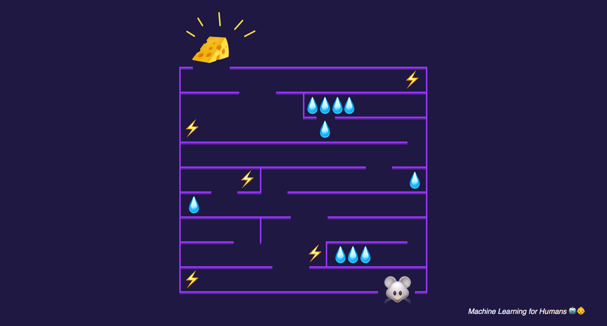

# 五、强化学习

> 探索和利用。马尔科夫决策过程。Q 学习，策略学习和深度强化学习。

> 我刚刚吃了一些巧克力来完成最后这部分。

在监督学习中，训练数据带有来自神一般的“监督者”的答案。如果生活可以这样，该多好！

在强化学习（RL）中，没有这种答案，但是你的强化学习智能体仍然可以决定如何执行它的任务。在缺少现有训练数据的情况下，智能体从经验中学习。在它尝试任务的时候，它通过尝试和错误收集训练样本（这个行为非常好，或者非常差），目标是使长期奖励最大。

在这个“写给人类的机器学习”的最后一章中，我们会探索：

+   探索和利用的权衡
+   马尔科夫决策过程（MDP），用于 RL 任务的经典配置
+   Q 学习，策略学习和深度强化学习
+   最后，价值学习的问题

最后，像往常一样，我们编译了一些最喜欢的资源，用于深入探索。

## 让我们在迷宫中放一个机器老鼠

思考强化学习的最简单的语境是一个游戏，它拥有明确的目标和积分系统。

假设我们正在玩一个游戏，其中我们的老鼠正在寻找迷宫的尽头处的奶酪的终极奖励（🧀 + 1000 分），或者沿路的水的较少奖励（💧 + 10 分）。同时，机器老鼠打算避开带有电击的区域（⚡ - 100 分）。

> 奖励就是奶酪

在一些探索之后，老鼠可能找到三个水资源的小型天堂，并且花费它的时间来利用它的发现，通过不断积累水资源的小型奖励，永远不深入迷宫来追求更大的奖励。

但是你可以看到，老鼠会错误迷宫深处的一片更好的绿洲，它就是尽头处的奶酪的终极奖励。

这就产生了探索和利用的权衡。老鼠的一种用于探索的简单策略是，在大多数情况下（可以是 80%），做出最佳的已知行为，但是偶尔探索新的，随机选取的方向，即使它可能远离已知奖励。

这个策略叫做 epsilon 贪婪策略，其中 epsilon 就是“给定全部已知知识的条件下，智能体做出随机选取的行为，而不是更可能最大化奖励的行为”的时间百分比（这里是 20%）。我们通常以大量探索起步（也就是较高的 epsilon 值）。一会儿之后，随着老鼠更加了解迷宫，以及哪个操作产生更大的长期奖励，它会将 epsilon 逐渐降到 10%，或者甚至更低，因为它习惯于利用已知。

重要的是要记住，奖励并不总是立即的：在机器老鼠的示例中，迷宫里可能有狭长的通道，你需要走过它，在你到达奶酪之前可能有好几个决策点。

> 智能体观测环境，做出行为来与环境互动，并接受正向或者负向的奖励。图片来自 [UCB CS 294：深度强化学习](https://rll.berkeley.edu/deeprlcourse-fa15/)，由 John Schulman 和 Pieter Abbeel 讲授

